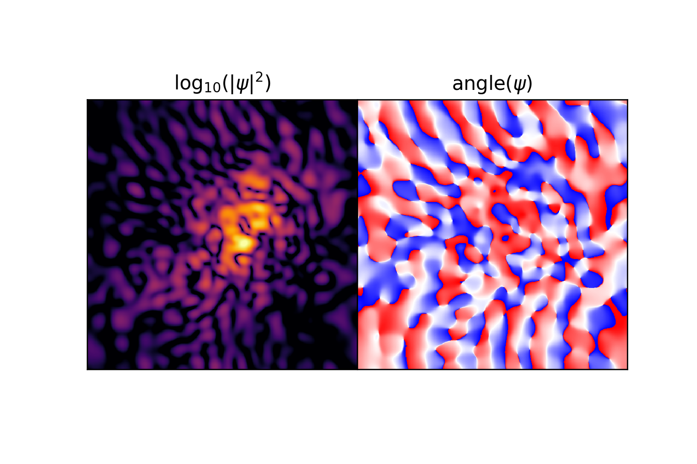

## Quantum Mechanics Simulation

A spectral method is a technique used in applied mathematics and scientific computing to numerically solve certain differential equations, potentially involving the use of the fast Fourier transform
=======
## Spectral Solver for Schrodinger-Poisson Quantum System
>>>>>>> 0f27bae9ebf02a96245fb7fb705b8b4ef18a2608

Simulate the Schrodinger-Poisson system with the Spectral Method

```
python quantumspectral.py
```

Schrodinger-Poisson solver to visualize the simulation in real time

